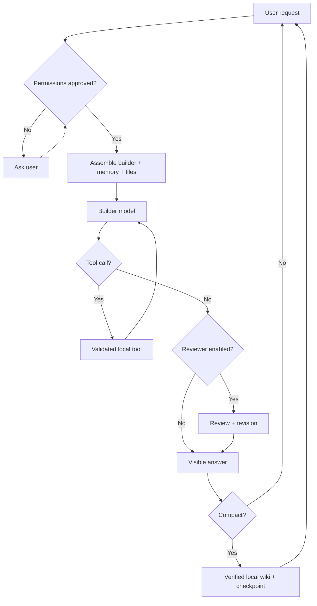

# Model Codex Desktop — Architecture Flow

The renderer is presentation-only. A narrow preload bridge carries validated requests to Electron main, where network, filesystem, connector, and Python authority is enforced. Credentials exist only in volatile session memory. Durable data is non-secret and local.

## Gates at a glance

| Gate | Enforcer | Rule |
|---|---|---|
| Tool permission | Electron main | Tool, file path, and host must be explicitly granted. |
| Credential persistence | Secret vault | Secrets are volatile and cleared on application quit. |
| Context compaction | Memory service | Triggered by a configurable token/turn threshold; preserves required state. |
| Long-term publication | Deterministic verifier | Evidence pointers and schema must validate before a wiki change is published. |
| External HTTP | Connector service | HTTPS by default; unsafe/private targets are rejected. |

## File index

| Stage | Intended files |
|---|---|
| Desktop boundary | `electron/main.ts`, `electron/preload.ts` |
| UI | `src/App.tsx`, `src/styles.css` |
| Agent loop | `src/services/agent-runtime.ts` |
| Memory | `src/services/memory.ts` |
| Tools | `src/services/tools.ts` |
| External APIs | `src/services/connectors.ts` |

The canonical master diagram is `docs/mermaid/01-desktop-agent-flow.mmd`. It remains master-granularity while the desktop lanes are still changing.
