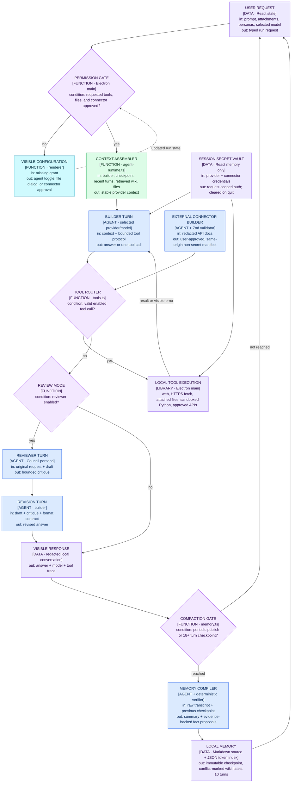

# Model Codex Desktop — Architecture Flow

The renderer is presentation-only. A narrow typed preload bridge carries validated requests from the exact `model-codex://app` origin to Electron main, where provider networking, local memory, connector requests, and tool authority are enforced. Credentials exist only in volatile renderer state and are passed request-by-request. Durable writes are serialized, atomic, recursively credential-redacted, and local.

## Gates at a glance

| Gate | Enforcer | Rule |
|---|---|---|
| Desktop trust | `electron/main.ts` + `electron/preload.cts` | Only the exact packaged scheme/hostname (or exact development origin) receives the narrow validated IPC bridge. |
| Tool permission | `electron/agent-runtime.ts` + `electron/tools.ts` | Only agent-enabled tools, attached files, and approved connector operations are exposed. |
| Credential persistence | React session state + `electron/secrets.ts` + storage schema | Credential fields never enter durable state; credential-shaped text is redacted again at attachment and write boundaries. |
| Durable state | `electron/storage.ts` | Validated saves are serialized and atomically renamed with mode `0600`. |
| Context compaction | `electron/memory.ts` + renderer | Checkpoint after 18 turns and six new turns; on acceptance, the latest ten messages remain while earlier context lives in the summary. |
| Long-term publication | Zod schema + exact-evidence verifier | A fact is written only when its quoted evidence occurs verbatim; same-page differences are marked as potential conflicts and oversized history is archived. |
| External HTTP | `electron/tools.ts` | HTTPS only; DNS-resolved loopback, link-local, and private targets are rejected, approved public addresses are pinned for the request, and redirects are revalidated. |
| Connector origin | Zod synthesis + `electron/tools.ts` | Documentation is credential-redacted; every operation must remain on the user-approved base origin before session credentials are attached. |
| Python | macOS sandbox profile | Network and personal-volume reads are denied; writes are limited to one temporary directory. |

## File index

| Stage | Files |
|---|---|
| Desktop boundary | `electron/main.ts`, `electron/preload.cts`, `electron/storage.ts` |
| Secret redaction | `electron/secrets.ts` |
| Provider layer | `electron/providers.ts` |
| Agent + review loop | `electron/agent-runtime.ts` |
| Memory compiler/retrieval | `electron/memory.ts` |
| Research and connector tools | `electron/tools.ts` |
| UI and volatile secret state | `src/App.tsx`, `src/styles.css` |

The canonical option-A diagram source is `docs/mermaid/01-desktop-agent-flow.mmd`; `docs/architecture-flow.html` is its standalone viewer. No in-app debug tab is included.
